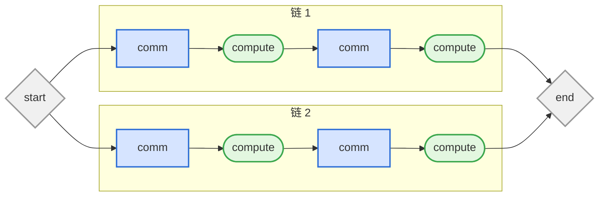
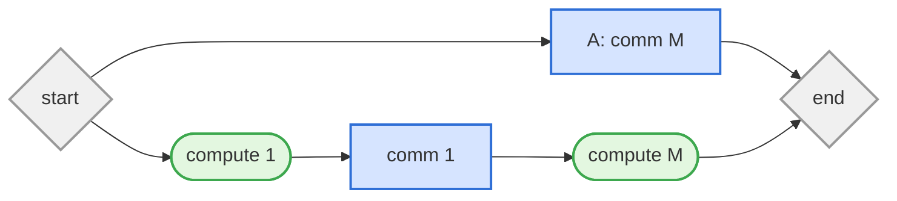

# LLM Training DAG 通信调度工作进度对齐

## 一、当前研究问题

给定 LLM training task DAG 和网络拓扑，研究通信 flow 应该按照什么顺序启动，才能增加通信与计算的
overlap，缩短整个 iteration 的 makespan。

任务图记为

$$
G=(V,E),\qquad V=V_{comp}\cup V_{comm}.
$$

- 计算节点有固定执行时间；
- 通信节点有数据量、源宿端点和 route；
- 边表示完成前置关系；


### 当前统一的执行语义

1. 单通道下一条 flow 启动后获得全部瓶颈带宽并完整传完；
3. 调度器只在 task-completion event 后重新规划；
4. 调度器可以主动 `WAIT`，也可以在多通道下只启动非最大兼容子集，为未来 flow 保留资源；
5. 优化目标为

$$
\min T,\qquad T=\max_{v\in V}C_v.
$$


## 二、精确求解

实现了两个相互独立的小图精确求解器：

- **Memoized DP**：缓存重复的 residual state；
- **Branch-and-Bound**：枚举完整决策树，使用上下界剪枝。

两者都能分别求：

- optional-idle OPT：允许主动等待；
- work-conserving OPT：有 ready flow 时必须工作。

状态记录每个 task 的 pending/running/completed、剩余时间、ready flows、active computes 和 route
reservation。求出的 action path 会重新回放，检查依赖、不可抢占和资源冲突。

### 结果

- 175 个小 DAG，共进行 700 次 exact 求解；
- 允许主动等待产生idle的OPT在 10/175 个图上优于不允许主动等待产生idle的OPT。

说明主动等待不是常态，但在少数关键场景中仍然关键。

### DP等精确求解的方法在大型DAG中会因状态过多而不适用

实验中 7 条 flow 约搜索约 600 个状态，14 条约 19000 个状态，15 条就容易超过当前 30000 状态或 2 秒
限制。

## 三、独立并行链

### 简化问题

先研究多条互相独立的“计算—通信—计算—通信”链，所有通信共享一个不可抢占 channel。



该问题的核心是：当前先传哪条 flow，会改变后续计算的释放时间，从而改变通信和计算 overlap。


### 并行链上的紧 2-近似结论

令

- $P$ 为全部通信时长之和；
- $Q$ 为任意一条链上的最大总计算时长；
- $I_H$ 为调度 $H$ 中网络被迫空闲的总时间。

> **定理：** 对独立并行链，任意 不允许主动WAIT、不可抢占、完整-flow 调度 $H$ 都满足
> $$T_H\le 2OPT.$$

**证明：** 单通道必须完成所有通信，因此

$$
T_H=P+I_H.
$$

取调度中最后完成的链。每当网络被迫空闲时，所有未完成链都没有 ready flow，所以最后完成链必然正在
计算。所有这些空闲区间可注入该链互不重叠的计算区间，故 $I_H\le Q$。

任意最优解至少要完成所有通信，也至少要经过最长链的计算，因此 $OPT\ge P$ 且 $OPT\ge Q$。于是

$$
T_H=P+I_H\le P+Q\le 2OPT.\qquad\square
$$

#### 紧例



`t=0` 只有 A ready，任何不允许主动WAIT的策略都必须先做 A，得到

$$
T_{wc}=2M+1.
$$

允许等待的最优解先等 1，再做 B 的短通信以启动长度为 $M$ 的计算，然后在该计算期间完成 A：

$$
OPT=M+2,qquad
\frac{T_{wc}}{OPT}=\frac{2M+1}{M+2}\rightarrow2.
$$

所以 2 对整个不允许主动WAIT的策略族是紧的。仅更换 FIFO、SPT、LPT 或 Longest tail 的优先级，
无法让这一策略族获得严格小于 2 的一般保证；突破该界需要允许等待或增加结构假设。

### 进一步比较多种贪心方法的实际效果

| 方法 | 含义 |
|---|---|
| FIFO / SPT / LPT | 按 ready 时间、短 flow 或长 flow 排序的基础对照 |
| Longest delay | 优先完成紧随其后的计算最长的 flow |
| Longest tail | 每个完成事件后，优先选择下游剩余关键路径最长的 ready flow |
| Rollout-flow-k | 试走前 $k$ 个 flow 候选，再用 Longest tail 补全到终点 |
| Rollout-WAIT-k | 除 flow 外，也试走主动等待动作 |
| Beam-8/32 | 同时保留多个部分调度继续搜索 |
| Monte Carlo-64 | 随机采样 64 个完整合法顺序并取最好者 |
| DP / 二分可行性 | 求小实例精确最优值或判断目标 makespan 是否可行 |

Longest tail 的规则为

$$
v^*=\arg\max_{v\in Ready(s)}q_s(v),
$$

其中 $q_s(v)$ 是当前 residual DAG 中，flow $v$ 完成后到终点的最长剩余路径。

Rollout 对候选动作 $a$ 的估值为

$$
\widehat C(s,a)=\Delta(s,a)+J_{Dynamic}(T(s,a)),
$$

即先执行候选动作，再用 Longest tail 完整跑到结束，直接比较预测 makespan。

### 100 个随机并行链结果

| 方法 | 最优数 | 平均 `makespan/OPT` | 最坏比值 |
|---|---:|---:|---:|
| Longest tail | 83/100 | 1.0144 | 1.1875 |
| Rollout-flow-2 | 91/100 | 1.0052 | 1.1154 |
| Rollout-WAIT-2 | **95/100** | **1.0023** | **1.0556** |
| Beam-WAIT-8/32 | 样本中 100/100 | 1.0000 | 1.0000 |

Top-4 相对 Top-2 没有额外收益，说明小候选集已经覆盖主要选择。


## 四、推广到一般 DAG

### 理论边界

并行链的 2-近似证明依赖“所有 forced idle 都属于最后完成链上的计算”。一般 fork/join DAG 中，不同
idle 区间可能由互不可比的分支造成，因此目前不能把紧 2 定理直接推广到一般 DAG。

当前能证明的是：只要 rollout 始终保留 Longest tail 的完整 schedule 作为 incumbent，就有

$$
T_{rollout}\le T_{Dynamic}.
$$

实验最坏比值不能代替一般近似保证。


### 实验结果

一般 LLM DAG 包含 fork、join、collective completion 和 optimizer gate，不能简单拆成独立链后组合。

111 个一般 DAG 的结果：

| 方法 | 最优数 | 平均比值 |
|---|---:|---:|
| Longest tail | 97/111 | 1.0102 |
| 原始 Join bonus | 72/111 | 1.0277 |
| Rollout-flow-2 | 101/111 | 优于基线 |
| Rollout-WAIT-2 | 107/111 | 接近最优 |
| Depth-2 | **110/111** | **1.0004** |
| Beam-WAIT-8 | **110/111** | **1.0004** |


### Join bonus 的结论

Join bonus 的策略定义如下。首先忽略通信资源竞争，在当前剩余 DAG 上估计每个未完成节点的最早完成时间：

$$
E_s(v)=d_s(v)+\max_{u\in pred(v),\ d_s(u)>0}E_s(u),
$$

其中 $d_s(v)$ 是节点在状态 $s$ 下的剩余执行时间。对于一个有多个前驱的 join 节点 $x$，若前驱
$v$ 的预计完成时间晚于其它前驱，则把它视为可能的“最后阻塞者”，定义

$$
g_s(v,x)=\max\left(0,
E_s(v)-\max_{u\in pred(x)\setminus\{v\}}E_s(u)
\right).
$$

$g_s(v,x)$ 表示：按照当前乐观估计，$v$ 会让 join $x$ 比其它输入全部到达的时刻晚多少。再令
$L_s(x)$ 为从 join $x$ 到 DAG 终点的最长剩余路径，定义 flow $v$ 的 Join bonus 为

$$
G_s(v)=\max_{x:\,v\in pred(x)}\left(g_s(v,x)+L_s(x)\right).
$$

原始 Join-bonus 策略在所有 ready flows 中选择

$$
v^*=\arg\max_{v\in Ready(s)}\left(q_s(v)+G_s(v)\right),
$$

其中 $q_s(v)$ 是 Longest tail 使用的下游剩余路径。直观上，该策略既优先下游链较长的 flow，也额外
优先可能卡住重要 join 的最后一个输入。

原始 Join bonus 相对 Longest tail：改善 0 个、相同 86 个、变差 25 个。主要原因是：

1. tail 已包含下游工作，再加 bonus 容易重复奖励；
2. 乐观 join 完成时间没有计算其它 flow 的排队；
3. 局部 join 提前不等于最终 makespan 提前。


## 五、多通道拓扑

具体拓扑中，每条 flow $v$ 使用 route resource set $R_v$。若活动 flow 已占用资源 $U$，合法启动集合
$S$ 必须满足

$$
R_u\cap R_v=\varnothing\quad(u,v\in S,u\ne v),
$$

$$
\left(\bigcup_{v\in S}R_v\right)\cap U=\varnothing.
$$

所以调度动作从“选择一条 flow”变成“选择一组完整、互不冲突的 flows”。

### 为什么不能总启动最大兼容集

```text
t=0 ready:
  a: comm(4), route r0
  b: comm(5), route r1

compute(1) -> c: comm(1), route r1 -> compute(6)
```

若 `t=0` 同时启动最大集合 `{a,b}`，c 在 `t=1` ready 后仍要等待 b，最终 makespan 为 12。

若只启动非最大集合 `{a}`，为 c 保留 $r_1$，则 c 可在 `[1,2)` 完成，最终 makespan 为 8。

这说明多资源下除了全局 `WAIT`，还必须允许只保留部分未来关键资源的 `START(non-maximal S)`。

### 37 个多通道小图结果

| 方法 | 最优数 | 平均比值 | 最坏比值 |
|---|---:|---:|---:|
| Dynamic-pack | 30/37 | 1.0272 | 1.5000 |
| Resource-pack | 30/37 | 1.0236 | 1.5000 |
| Bottleneck-pack | 31/37 | 1.0241 | 1.5000 |
| Rollout-maximal-2 | 33/37 | 1.0189 | 1.5000 |
| Rollout-optional-2 | **36/37** | **1.0014** | **1.0526** |

Optional exact 在 4/37 个图上严格优于只允许最大集合的 exact。显式全局 WAIT 只出现 2 次，其余收益来自
非最大启动集合。

把所有 route 压成单通道，相对真实多资源 OPT 平均高估 15.50%，最大高估 57.14%。因此单通道适合研究
顺序和等待的基本机制，但不能代替具体拓扑性能估计。

安全下界为

$$
LB=\max\left\{L_{DAG},\max_r\sum_{v:r\in R_v}p_v\right\}.
$$

目前尚未得到多资源 heuristic 的一般常数近似比。

## 六、当前总体结论

1. **Longest tail 适合作为低成本基础策略。** 它快速、稳定、可解释，但不是最优算法；
2. **有限前瞻是目前最有效的通用增强。** Rollout-WAIT-2 已修复大多数失败实例，Top-4 通常无额外收益；
3. **主动等待必须保留，但应谨慎触发。** 它只在少数近期关键 release 场景中有价值；
4. **多资源下非最大启动比全局等待更重要。** 需要有选择地保留未来关键 route，而不是让所有资源空闲；
5. **Join bonus 暂不采用。** Join 适合生成候选，不适合直接叠加分数；
6. **理论结果目前只覆盖独立并行链。** 任意不允许主动等待的策略有紧 2 界；一般 DAG 和多资源尚无常数界；

当前通用策略可以概括为：

```text
每个 task-completion event
  -> 在 residual DAG 上计算 Longest tail
  -> 生成 2 个左右的通用候选
  -> 加入 WAIT 或 non-maximal START(S)
  -> 用 Longest tail 完整补全并比较预测 makespan
  -> 启动选中的完整 flow / compatible set
```

## 七、下一步尝试利用 LLM 特殊结构

下一阶段研究 LLM training DAG 中可重复、可预测的结构，能否生成通用 rollout 看不到的高价值候选。


## 八、相关论文

1. Leslie A. Hall, David B. Shmoys, **Jackson's Rule for Single-Machine Scheduling: Making a Good Heuristic
   Better**, *Mathematics of Operations Research*, 1992。讨论 release time、delivery tail、Jackson rule、
   PTAS 和带 precedence 的近似算法：[DOI](https://doi.org/10.1287/moor.17.1.22)。
2. Nodari Vakhania, **Single-Machine Scheduling with Release Times and Tails**, *Annals of Operations
   Research*, 2004。讨论 $1|r_j,q_j|C_{max}$ 的复杂性、算法与特殊可解情形：
   [DOI](https://doi.org/10.1023/B:ANOR.0000030692.69147.e2)。
3. Saksham Agarwal et al., **Sincronia: Near-Optimal Network Design for Coflows**, *ACM SIGCOMM*, 2018。
   说明 coflow 场景中 ordering 与 priority transport 的重要性：
   [DOI](https://doi.org/10.1145/3230543.3230569)。
